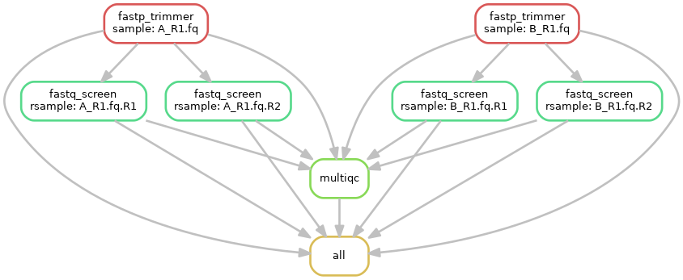

# Snakemake pipeline: ngs-cleaning

This pipeline aims to clean any kind of fastq files from any kind of modern sequencing technology.

Please, have a look at the [wiki](https://github.com/tdayris-perso/ngs-cleaning/wiki) for more information.

